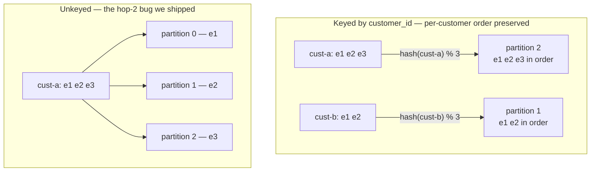
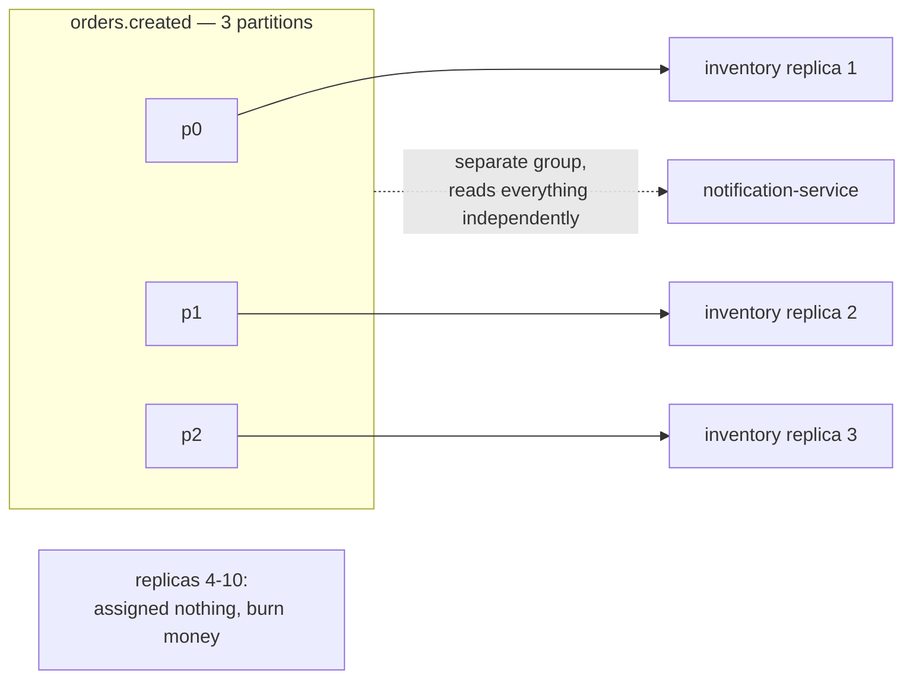
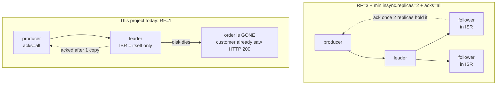
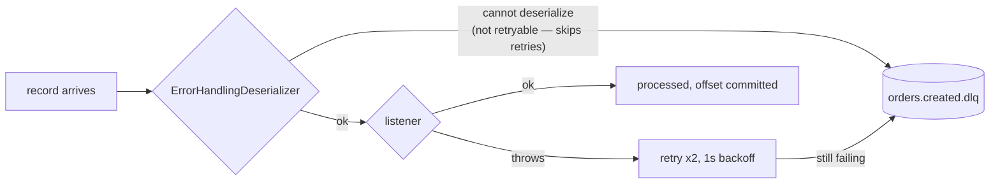

# Week 1 — Messaging Semantics & Kafka Mechanics

Read [00-start-here.md](00-start-here.md) first if you've been away.

**Part 1** is the narrative — read it when learning or returning after a gap.
**Part 2** is self-test. **Part 3** is the dense recall card for interview eve.

> **Where this week comes from.** It's the foundation: how facts move between
> services at all. Everything later — the outbox, idempotency, sagas — exists
> to work around the guarantees this week does *not* give you.

---

# Part 1 — The story

## 1.1 Why a log, and not a queue

Three messaging models get lumped together as "async messaging." The real
difference isn't fan-out — it's **who owns the read position, and whether
history survives being read**.


- **Message queue** (SQS, RabbitMQ queue): the broker deletes the message once
  it's acknowledged, and competing consumers split the work. Great for task
  distribution. But there's no fan-out and no history — once consumer A takes
  message 1, it's gone.
- **Pub/sub** (SNS, JMS topics): fans out to every subscriber, but it's
  *ephemeral*. A subscriber that's down at publish time simply misses the
  message. There's no rewind.
- **Event stream** (Kafka/Redpanda): an append-only, durable, ordered log with
  a retention window. **Reading does not delete.** Each consumer group tracks
  its *own* position, so three groups can sit at three different offsets in the
  same topic simultaneously.

**Why this matters for your system:** `inventory-service` and
`notification-service` are separate consumer groups reading independently.
That's what makes the Black Friday story work — inventory can be down for two
hours and then resume from its own committed offset, because the log kept
everything and nobody else's progress affected it.

**Trap:** saying "Kafka is pub/sub" undersells it badly. The log plus
consumer-owned offsets is what enables catching up after downtime, adding a
brand-new consumer that reads all history, and reprocessing after a bug fix.
None of those exist in classic pub/sub.

## 1.2 Replay: what actually makes it possible ⚠️

**This is the section that didn't land in the drill — three attempts, three
misses. Read it slowly.**

The question "how do I replay?" has a two-part answer, and the mistake is
answering with the wrong half.

**Part one — why replay is even possible: retention.**

Kafka keeps records on disk according to a *retention policy* —
`retention.ms` (default **7 days**) and/or `retention.bytes` — and
**consumption has nothing to do with it.** A message read by ten consumer
groups and a message read by nobody are deleted at exactly the same time.
That's the property a queue doesn't have: in a queue, reading destroys.

So the data is sitting there. Replay is just *moving your read position
backwards*.

**Part two — how you actually move: the committed offset.**

An offset is a per-`(group, partition)` bookmark stored in the
`__consumer_offsets` topic. To replay, you change that bookmark.

**Worked scenario.** `inventory-service` processed three days of orders, but a
bug corrupted the results. You need it to reprocess those three days. Your
options:

1. **Reset the existing group's committed offsets.** Stop the consumers (the
   group must be inactive), then:
   ```bash
   kafka-consumer-groups --bootstrap-server ... \
     --group inventory-service --topic orders.created \
     --reset-offsets --to-datetime 2026-07-02T00:00:00.000 --execute
   ```
   Restart, and it re-reads from that timestamp. (`--to-earliest`,
   `--shift-by -1000`, and `--to-offset N` are the other common variants.)
2. **Attach a brand-new consumer group.** A new `group.id` has no committed
   offset at all, so it starts wherever `auto-offset-reset` says. This is the
   go-to when you want to reprocess *without* disturbing the live consumer.
3. **Seek programmatically** — `consumer.seek(partition, offset)` inside a
   `ConsumerSeekAware` listener, for surgical cases.

**The trap that caught you three times.** `auto-offset-reset: earliest`
answers exactly one question:

> *"This group has **no committed offset**. Where should it start?"*

That's it. It fires for a brand-new group, or when the committed offset has
aged out of retention. For a group that already has a committed offset —
which is every running consumer — **the setting is ignored entirely**.
Changing it and restarting does nothing. It is not a replay button; it's a
first-run default.

Note how option 2 above works *because of* this: the new group has no offset,
so `earliest` applies and it reads from the start. Same setting, but it's the
*newness of the group* doing the work, not the setting overriding anything.

**The one-sentence answer to have ready:**

> *Kafka retains the log by time or size policy regardless of consumption —
> reading never deletes — so to replay I reset the consumer group's committed
> offsets with `kafka-consumer-groups --reset-offsets`, or attach a new group.
> `auto-offset-reset` only decides where a group with no committed offset
> begins.*

## 1.3 Delivery semantics are decided by operation order

The at-most-once / at-least-once / exactly-once taxonomy sounds like a config
setting. It isn't. It reduces to one question: **in what order do you process
the message and commit the offset?**

| Order of operations | Crash consequence | Name |
|---|---|---|
| commit offset → then process | work never done, message never redelivered | **at-most-once** (loses) |
| process → then commit offset | processed, but redelivered on restart | **at-least-once** (duplicates) |
| both atomically | neither happens alone | **exactly-once** |

Your consumers are at-least-once: Spring Kafka's default commits after the
listener returns. That's why dedup isn't defensive boilerplate — it's the
mandatory second half of the choice.

**Trap:** "exactly-once" is exactly-once **within Kafka's log**. Kafka
transactions can atomically bind "I consumed offset X and produced record Y."
The moment your consumer touches the outside world — an email API, a payment
call — no Kafka transaction protects you. If `notification-service` called a
real email provider, a rebalance-triggered reprocess would send a second
email, transactions or not.

**The senior framing:** real systems run **at-least-once + idempotent
consumers = effectively-once**. That's the sentence to say.

**Two dedup layers, often confused:**

- **Broker-level idempotent producer** (`enable.idempotence`, on by default in
  modern clients): the broker dedups by `(producer_id, sequence_number)`. This
  stops *retried writes* — you sent it, the ack got lost in the network, you
  retried, and the broker recognises the duplicate.
- **Application-level dedup by business key** (your `event_id`): this stops
  *reprocessing* — crashes, rebalances, redeliveries.

Different failure modes. You need both, and they don't substitute.

## 1.4 Ordering lives in the partition — and the key chooses it

Kafka guarantees ordering **within a partition only**. There is no topic-wide
ordering, ever. So every ordering question is really a *key* question, because
the key decides the partition: `hash(key) % partition_count`.



The key does three jobs at once: it sets the **ordering scope** (per-customer
here), the **parallelism grain**, and the **hotspot risk** (one whale customer
= one hot partition).

### The war story — tell this unprompted

This is your best interview asset, and it went untold in the drill. The
60-second version:

> *We keyed `orders.created` by `customer_id`, so a customer's events stayed
> ordered. But at the second hop, `inventory-service` published
> `inventory.result` with **no key** — so one customer's results round-robined
> across all three partitions and were consumed concurrently, in any order.
> The guarantee we'd designed for silently stopped being true one hop in.*
>
> *Nothing alerted. No metric watches "are this key's events still landing on
> one partition" — it isn't an error, it's just a different partition. We
> found it in review, not from monitoring. The fix was to key every hop by
> `customer_id`. The lesson: an ordering guarantee has to survive **every**
> hop, and its absence is invisible.*

**Second trap: partition count is a one-way door.** Adding partitions changes
`hash(key) % N` for every existing key, so a customer whose history sits on
partition 1 starts landing on partition 4. Ordering continuity breaks
silently, and you can never reduce the count. Choose it up front, sized for a
target scale.

## 1.5 Consumer groups: one logical subscriber, with a hard ceiling

Within a group, each partition is assigned to exactly **one** member. Across
groups, every group reads everything independently.



**Partition count is therefore your parallelism ceiling.** Your topics have 3
partitions, so scaling `inventory-service` to 10 replicas gets you 3 working
consumers and 7 idle ones. This is a real constraint for the HPA work in
Weeks 5–7 — autoscaling a consumer past its partition count does nothing.

**Rebalancing, and the trap interviewers love.** A rebalance redistributes
partitions when membership changes — but membership changes on *perceived*
death too. If your listener takes longer than `max.poll.interval.ms` (default
5 minutes) to return, the coordinator assumes the consumer is dead, kicks it
out, and rebalances. Consumption pauses on the affected partitions, and
in-flight work gets reprocessed by whoever picks up the partition.

**So slow processing *causes* duplicates.** That's the non-obvious link:
performance problems become correctness problems in a consumer group.
Cooperative-sticky assignment (Spring Kafka's default since 2.7) softens the
stop-the-world pause but doesn't eliminate it.

## 1.6 Durability: `acks` is a contract with the ISR ⚠️

**Second drill gap. The thing you never said out loud was "the order is
lost." Say it here.**

**ISR** = In-Sync Replicas: the set of replicas currently caught up with the
leader. It's dynamic — a follower that falls behind is *removed* from the ISR
and re-added when it catches up.

`acks=all` means: *the leader acknowledges once every member of the **current
ISR** has the record.* Read that carefully — it's "all of the ISR," not "all
replicas," and not "at least N copies."



**Trace it on your actual system.** Your topics are created with
`.replicas(1)`, and your producer sets `acks: all`:

```
1. POST /orders → order-service publishes with acks=all
2. Leader is the only replica, so ISR = {leader}
3. Leader writes to its log and acks   ← "all of the ISR" = 1 copy
4. HTTP 200 returned. Customer sees a confirmation.
5. ⚡ that broker's disk fails
→ THE ORDER IS PERMANENTLY LOST.
  It exists nowhere. The customer holds a confirmation for an order
  no system has ever heard of.
```

`acks=all` with RF=1 is `acks=1` wearing a costume. Saying this about your own
project, unprompted, is a strong signal — it shows you read configuration as a
*system property*, not a checkbox.

**The trio — recite all three together, because any one alone is meaningless:**

> **RF=3 + `min.insync.replicas=2` + `acks=all`**

- **RF=3** — three copies exist.
- **`min.insync.replicas=2`** — the producer's write is *rejected* unless at
  least 2 replicas are in the ISR. This is the piece that stops `acks=all`
  from silently degrading: without it, if followers lag and the ISR shrinks to
  just the leader, `acks=all` quietly becomes a single-copy write and you'd
  never know.
- **`acks=all`** — wait for the (now guaranteed ≥2) ISR members.

**And the trade-off, which is the part that gets asked:** one broker can die
with zero acked-data loss and writes continue. When a **second** broker dies,
the ISR drops below 2 and **producers start failing** — the cluster refuses
writes rather than accept unsafe ones. That's deliberately choosing
consistency over availability.

**Unclean leader election** is the same dial, made explicit: allow an
out-of-ISR (lagging) replica to become leader and the cluster stays available,
but you can lose **already-acknowledged** writes. Default is `false`, and it
should stay that way unless you truly prefer availability to correctness.

## 1.7 Poison messages, retries, and the DLQ

A single record that can never be processed will, if handled naively, block
its partition **forever** — the consumer retries, fails, retries, and no
record behind it makes progress. That's the failure mode the whole
retry/DLQ apparatus exists to prevent.



Your wiring: `DefaultErrorHandler` with `FixedBackOff(1000L, 2)` and a
`DeadLetterPublishingRecoverer` routing to `orders.created.dlq` (and
`inventory.result.dlq` at hop 2).

**Note the asymmetry in that diagram.** A malformed payload goes **straight**
to the DLQ with no retries, because `DefaultErrorHandler` classifies
`DeserializationException` as fatal — retrying a byte sequence that will never
parse is pointless. Only *listener* exceptions get the backoff.

**Why `ErrorHandlingDeserializer` must wrap the deserializer:**
deserialization happens *before* your listener code runs. Without the wrapper,
the failure occurs deep inside the consumer's poll loop where your error
handler can't reach it. The wrapper catches it and turns it into something the
error handler can route.

**Two things to have ready:**

- **A DLQ with no consumer is a write-only graveyard.** "What happens to
  messages after they land in the DLQ?" is the standard follow-up, and the
  honest answer for this project today is *"nothing — no monitoring, no
  replay path; that's Week 8 observability work."* Note also that DLQ payloads
  here are base64-wrapped by the serializer, so a replay tool must decode.
- **Consumer lag is the metric that ties it all together.** Lag growing =
  consuming slower than producing. It's the first thing you'd page on, and the
  symptom that shows up for poison messages, rebalance storms, and
  under-provisioned consumers alike.

---

# Part 2 — Self-test

Answer out loud before scrolling. Ten minutes, mid-week.

1. What single property distinguishes an event stream from pub/sub? Why does
   it matter for a consumer that's been down for two hours?
2. You need to reprocess three days of already-consumed events. What do you
   actually do? Why won't `auto-offset-reset` help?
3. What determines whether a consumer is at-most-once or at-least-once?
4. Kafka transactions give you exactly-once. Where does that guarantee stop?
5. A customer double-clicks "order," then cancels. What guarantees those three
   events are processed in order — and what breaks it?
6. Your topics have 3 partitions. You scale the consumer to 10 replicas. What
   happens?
7. Your listener starts taking 6 minutes per message. Describe the failure
   that follows.
8. `acks=all`, RF=1, the broker's disk dies one second after the ack. Where is
   the order?
9. What does `min.insync.replicas=2` actually prevent? What breaks when a
   second broker dies?
10. A malformed JSON record arrives. Trace its path. How many retries?

<details>
<summary><b>Answers</b></summary>

1. **Reading doesn't delete** — a durable, retained log with consumer-owned
   offsets. So a consumer down for two hours resumes from its own committed
   offset and catches up; in pub/sub those messages are simply gone.
2. Reset the group's committed offsets
   (`kafka-consumer-groups --reset-offsets --to-datetime ... --execute`, group
   stopped), or attach a **new** consumer group. `auto-offset-reset` only
   applies when a group has **no committed offset** — a running group ignores
   it entirely.
3. The **order of processing vs. offset commit**. Commit-then-process =
   at-most-once (loses on crash); process-then-commit = at-least-once
   (duplicates on crash).
4. At the boundary of Kafka. It covers consume-process-produce *within* the
   log. Any external side effect — email, payment, third-party HTTP — needs
   its own idempotency key.
5. Same partition + single consumer for that partition. The key
   (`customer_id`) puts them on one partition. It breaks if the publish is
   **unkeyed** (round-robin across partitions — our hop-2 bug), or if
   partition count changes and remaps the key.
6. 3 replicas get one partition each; **7 sit idle**. Partition count is the
   parallelism ceiling — autoscaling past it does nothing.
7. It exceeds `max.poll.interval.ms` (default 5 min), so the coordinator
   treats it as dead, evicts it, and **rebalances**. Consumption pauses and
   in-flight work is **reprocessed** — slow processing causes duplicates.
8. **Permanently lost.** ISR = {leader} only, so `acks=all` acked after one
   copy. The customer holds a confirmation for an order that exists nowhere.
9. It stops `acks=all` **silently degrading** to a single-copy write when
   followers fall out of the ISR — the write is rejected instead. When a
   second broker dies the ISR drops below 2 and **producers block**:
   consistency chosen over availability, deliberately.
10. **Zero retries.** `ErrorHandlingDeserializer` surfaces it,
    `DefaultErrorHandler` classifies `DeserializationException` as fatal, and
    it goes straight to `orders.created.dlq`. Only listener exceptions get the
    2 retries with 1s backoff.

</details>

---

# Part 3 — Recall card

Interview-eve density. If a line doesn't unpack into its *why*, reread that
section in Part 1.

- **Queue vs pub/sub vs stream:** the axis is *who owns position and does
  reading delete*. Stream = durable retained log + consumer-owned offsets ⇒
  catch-up, new consumers, replay.
- **Replay:** retention keeps data regardless of consumption (default 7 days).
  Replay = reset committed offsets (`--reset-offsets`) or new group.
  `auto-offset-reset` **only** applies when no committed offset exists.
- **Semantics = operation order:** commit-first → at-most-once; process-first →
  at-least-once; atomic → exactly-once. Real systems:
  **at-least-once + idempotent consumer = effectively-once.** EOS stops at
  Kafka's boundary.
- **Two dedup layers:** broker idempotent producer (retried writes) vs. app
  dedup by `event_id` (reprocessing).
- **Ordering = per partition only**, and the key picks the partition. Key sets
  ordering scope + parallelism grain + hotspot risk. **Must survive every
  hop** (our bug). Partition count is a one-way door — adding remaps
  `hash(key) % N`.
- **Consumer group:** one partition → one member. **Partition count = the
  parallelism ceiling** (3 partitions, 10 replicas ⇒ 7 idle). Rebalances fire
  on *perceived* death — exceed `max.poll.interval.ms` and slow processing
  becomes duplicates.
- **Durability:** `acks=all` = "all of the **current ISR**". RF=1 ⇒ it's
  `acks=1` and an acked order dies with the disk — **say "the order is lost."**
  Trio: **RF=3 + min.insync.replicas=2 + acks=all**; `min.isr` prevents silent
  degradation; second broker loss **blocks producers** (consistency over
  availability). Unclean leader election = lose acked writes to stay available.
- **Poison messages:** bounded retries → DLQ, else the partition blocks
  forever. Deserialization failures are fatal → **straight to DLQ, no
  retries**. DLQ without monitoring/replay = write-only graveyard. **Consumer
  lag** is the page-worthy metric.

**Meta-frame — Week 1's trade-offs are about the transport:**

1. Latency vs. durability → `acks`
2. Throughput/parallelism vs. ordering → partitions and keys
3. Availability vs. consistency → `min.insync.replicas`, unclean leader election
4. Simplicity vs. delivery strength → at-least-once + idempotency vs. transactions
