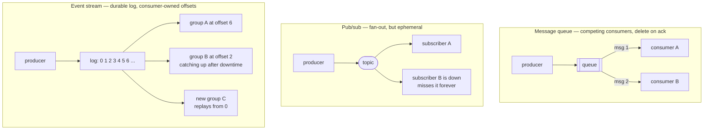
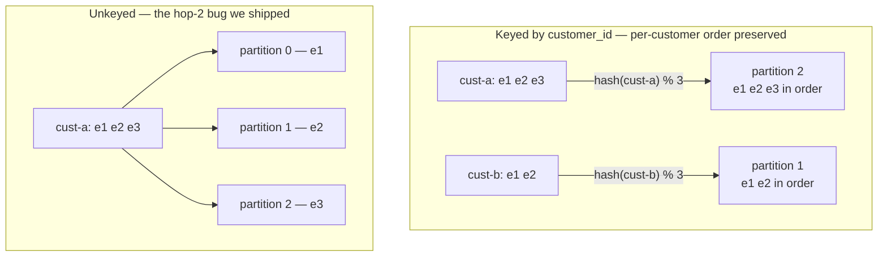
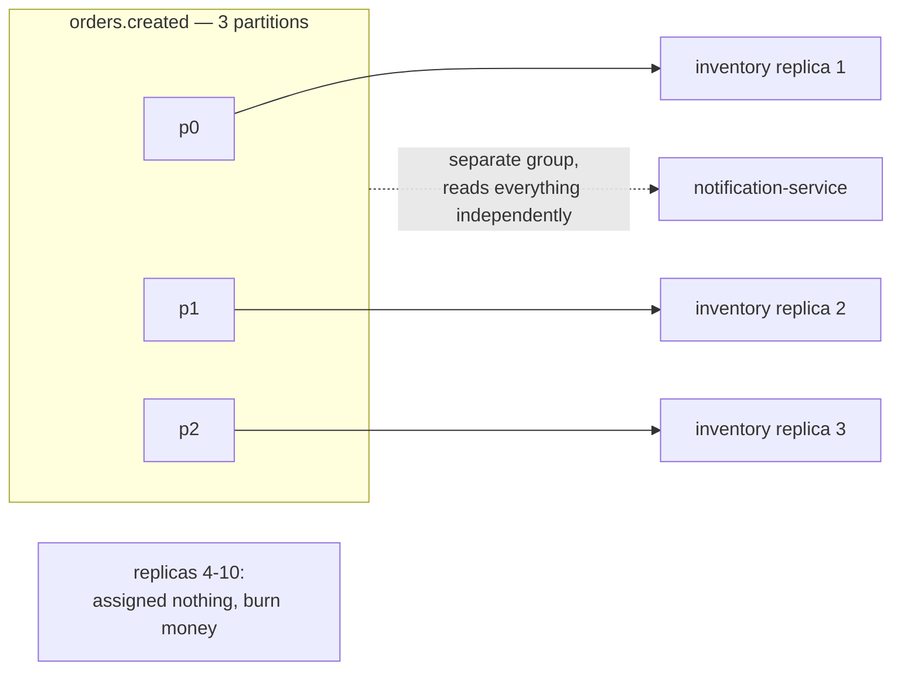
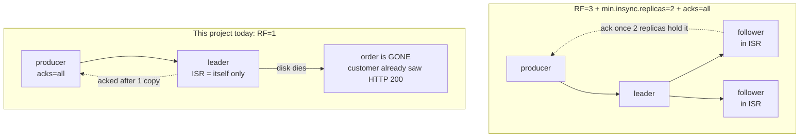
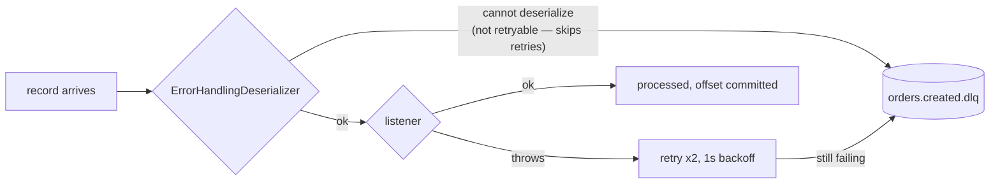

# Week 1 — Messaging Semantics & Kafka Mechanics (study sheet)

Interview one-pager: the mental models that generate correct answers, plus the
trap hiding inside each one. Anchored to `order-events-system` — "I built this
and hit this exact bug" is both the best retention device and the best
interview answer.

## 0. Queue vs. pub/sub vs. event stream — who owns replay and position?

The real differentiator between messaging models isn't fan-out; it's *who
owns the read position and whether history can be replayed*:

- **Message queue** (SQS, RabbitMQ queue): delete-on-ack, competing
  consumers. Good for task distribution / load leveling. No replay, no
  fan-out — once one consumer takes it, it's gone.
- **Pub/sub** (SNS, JMS topics): fans out, but *ephemeral* — a subscriber
  that's down or not yet subscribed at publish time misses the message
  (absent pre-provisioned durable subscriptions). No rewind.
- **Event stream** (Kafka/Redpanda): durable, ordered, append-only log with
  retention. Each consumer group tracks its *own* offset and reads the full
  history at its own pace. **Replay + independent consumption position** is
  the differentiator, not fan-out.

**Trap:** "Kafka is pub/sub" undersells it. The log + consumer-owned offsets
is what enables: catching up after downtime (notification-service down an
hour just resumes from its committed offset), adding a brand-new consumer
that reads history from the beginning, and reprocessing after a bug fix.
None of those exist in classic pub/sub.

## 1. Delivery semantics are decided by operation order, not configuration

The at-most-once / at-least-once / exactly-once taxonomy reduces to one
question: *in what order do you process a message and commit its offset?*

- Commit-first → **at-most-once** (crash loses work)
- Process-first → **at-least-once** (crash duplicates work)
- Atomically both → **exactly-once**

**Trap:** "exactly-once" is exactly-once *within Kafka's log*. The moment a
consumer touches the outside world (email API, external HTTP call), no Kafka
transaction protects you — you need idempotency at that boundary.

The senior framing: real systems run **at-least-once + idempotent consumers =
effectively-once** — exactly what the `event_id` dedup in `InventoryConsumer`
implements.

Keep the two dedup layers distinct:
- **Broker-level idempotent producer** (`producer_id` + sequence) dedups
  *retried writes* — e.g. an ack lost over the network after the write landed.
- **App-level dedup by business key** handles *reprocessing* — crashes,
  rebalances.

Different failure modes; both needed.

## 2. Ordering = partition key choice, nothing else

Kafka guarantees order **within a partition only**. Every ordering discussion
is really a key-choice discussion, and the key simultaneously sets three
things: ordering scope (per-customer here), parallelism grain, and hotspot
risk (one whale customer = one hot partition).

Round-robin across partitions means three consumers process one customer's
events concurrently, in any order. Nothing errors; the guarantee just quietly
stops being true.

**Two traps:**
- The key must survive *every hop*. Lived this one: `inventory.result` was
  published unkeyed, silently breaking per-customer ordering at hop two.
- Changing partition count remaps `hash(key) % N` for all existing keys —
  ordering continuity breaks silently. Partition count is effectively a
  one-way, day-one decision (you can add, never remove).

## 3. A consumer group is one logical subscriber

Within a group, partitions are divided among members — so **partition count
is the parallelism ceiling** (3 partitions = max 3 useful `inventory-service`
replicas). Across groups, each group independently reads everything — that's
the fan-out.

- Offsets are per `(group, partition)`, stored in `__consumer_offsets`.
- `auto-offset-reset: earliest` only applies when *no committed offset
  exists*. It is **not** a replay button — changing it does nothing for an
  existing group.

**The trap interviewers love:** rebalances trigger not just on real
membership changes but on *perceived death* — a listener exceeding
`max.poll.interval.ms` (default 5 min) looks dead, triggers a rebalance,
pauses consumption, and reprocesses in-flight work. **Slow processing
therefore causes duplicates.** Cooperative-sticky assignment (the modern
default) softens but doesn't eliminate the pause.

## 4. Durability is an acknowledgment contract — `acks=all` alone is paper

`acks=all` means "acknowledged by the *current ISR*". If the ISR has shrunk
to just the leader, that's one copy.

Recite the trio together — any one alone is meaningless:
**RF=3 + `min.insync.replicas=2` + `acks=all`** → one broker dies with zero
loss and writes continue; a second death blocks producers — deliberately
trading availability for consistency.

Left: one broker can die with zero loss and writes continue; a *second* loss
drops the ISR below 2 and producers **block** — availability traded for
consistency, deliberately. Right: `acks=all` with a single replica is
`acks=1` wearing a costume.

This project is the honest counterexample: `acks: all` is configured, but
topics are `replicas(1)`, so today it's equivalent to `acks=1`. Saying that
unprompted is a strong signal.

**Unclean leader election** is the explicit availability-vs-consistency
dial: allow a lagging (out-of-ISR) replica to become leader and you can lose
*already-acknowledged* writes. Safe default: off.

## 5. Failure handling: the poison message is the central villain

One undeserializable record, naively handled, blocks its partition forever.
The pattern: *bounded* retries → DLQ — which is what `DefaultErrorHandler` +
`DeadLetterPublishingRecoverer` does here (2 retries, 1s backoff, then
`orders.created.dlq`).

Note the asymmetry: a malformed payload goes **straight** to the DLQ —
`DefaultErrorHandler` classifies `DeserializationException` as fatal, since
retrying a byte sequence that will never parse is pointless. Only *listener*
exceptions get the backoff.

Nuances to have ready:
- Deserialization failures happen *before* listener code runs — that's why
  `ErrorHandlingDeserializer` must wrap the deserializer itself.
- A DLQ without a monitoring-and-replay story is a write-only graveyard.
  "What happens to messages after they land in the DLQ?" is the standard
  follow-up.
- **Consumer lag** is the health metric that ties it together: lag growing =
  consuming slower than producing = your first page.

## The meta-frame

Almost every interview question in this domain is one of four trade-offs
wearing a costume:

1. **Latency vs. durability** — acks
2. **Throughput/parallelism vs. ordering** — partitions and keys
3. **Availability vs. consistency** — min.ISR, unclean leader election
4. **Simplicity vs. delivery strength** — at-least-once + idempotency vs.
   transactions

Name which trade-off the question is really about, then say what breaks when
each component fails — that's the altitude being tested.
