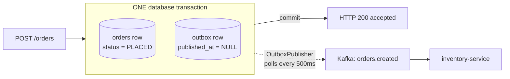
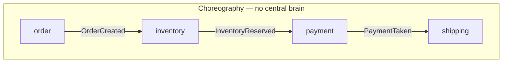
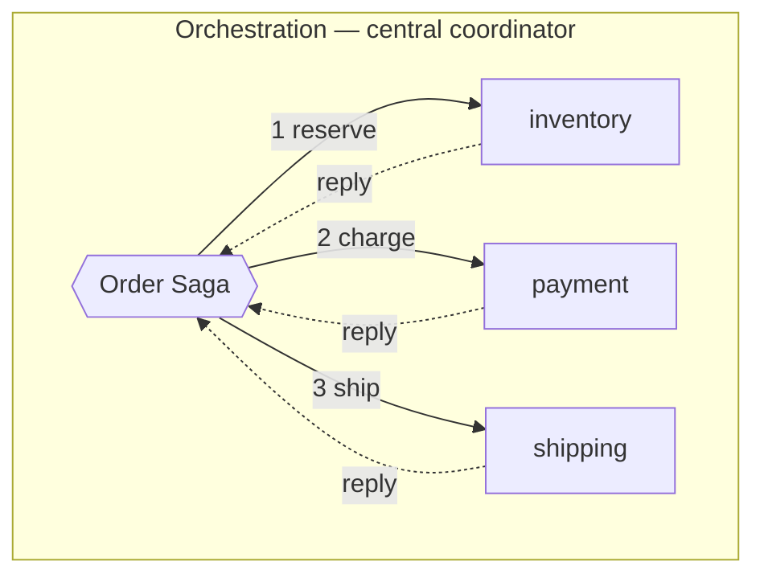

# Week 2 — Event-Driven Patterns

Read [00-start-here.md](00-start-here.md) first if you've been away.

**Part 1** is the narrative — read it when learning or returning after a gap.
**Part 2** is self-test. **Part 3** is the dense recall card for interview eve.

> **Where this week comes from.** Week 1 gave you a durable log that decouples
> services in time. But `order-service` had no database — it just published and
> forgot. The moment a real service must *remember* orders, it has to write to
> two places at once, and that's where this week begins.

---

# Part 1 — The story

## 1.1 Adding a database creates a problem that didn't exist before

Week 1's `order-service` did one thing: publish to Kafka. One write, no
atomicity question.

But a real order service must persist orders — you need `GET /orders/{id}`,
you need the row to survive a restart, you need it to be the system of record
for "did this customer actually order this?" So we added Postgres.

Now `POST /orders` must do **two** things:

1. `INSERT` the order into Postgres
2. Publish `OrderCreated` to Kafka

And here's the uncomfortable part: **there is no way to make those two writes
atomic.** Postgres transactions cover Postgres. Kafka transactions cover
Kafka. Nothing spans both. (XA/two-phase commit technically exists and is
almost universally avoided — it's slow, and it makes both systems'
availability depend on each other.)

So adding the database didn't make the system worse — persistence was
non-negotiable. It just surfaced a problem that was always waiting.

## 1.2 The dual-write problem, traced concretely

"Dual write" is the name. Here's the mechanism — and note that the killer is
a **crash**, not an exception. An exception you could catch and retry. A
process that dies has no chance to do anything.

**Ordering A — database first, then publish:**

```
1. INSERT order 7f3a into orders          ✓ committed
2. ⚡ process is killed (OOM, pod evicted, node dies)
3. kafkaTemplate.send(...)                 never runs
```

Result: the order exists in your database. The customer sees it in their
account. **No downstream service ever hears about it.** Inventory never
reserves stock, notification never emails. The order sits in `PLACED` forever.
Silent, permanent, and nothing in the system is "wrong" enough to alert on.

**Ordering B — publish first, then database:**

```
1. kafkaTemplate.send(...)                 ✓ broker acked
2. ⚡ process is killed
3. INSERT order 7f3a into orders           never runs
```

Result: inventory has already reserved stock for an order **that does not
exist**. The customer's `GET /orders/7f3a` returns 404 while your warehouse
has product set aside. And you cannot un-publish — consumers have already
acted on it.

**Which is worse?** B, generally — A is an under-delivery you can detect and
reconcile later; B has already caused external side effects for a fact that
isn't true. But the real answer is that *both are unacceptable*, which is why
the pattern exists.

**The insight that unlocks the fix:** you can't make two writes atomic — so
stop doing two writes. Write the event **into the same database**, in the
**same transaction**, and move it to Kafka afterwards.

## 1.3 The outbox: collapse two writes into one



`OrderController.createOrder()` is `@Transactional` and does exactly two
inserts, **both into Postgres**:

- the `orders` row — current-state business data
- the `outbox` row — the serialized `OrderCreated` event, with
  `published_at = NULL` meaning "not yet relayed"

Either both commit or neither does. That's ordinary database atomicity — no
distributed anything.

`OutboxPublisher` then runs every 500ms: select rows where
`published_at IS NULL`, send each to Kafka, stamp `published_at`.

**Two table roles — don't mix these up:**

| | `orders` | `outbox` |
|---|---|---|
| Holds | current state ("where is this order *now*") | the event log ("what *happened*") |
| Rows per order | one, mutated over time | one per event, immutable |
| Answers | "what's the status?" | "what occurred, and in what order?" |

**Why not just poll the `orders` table** and skip the outbox? Two reasons that
matter:

1. **One row can't hold multiple events.** An order is created, then amended,
   then cancelled — three events. The `orders` table ends up with a single
   row reading `status = CANCELLED`. Poll it and you learn only the ending.
   The amendment never happened, as far as any consumer knows.
2. **The payload must be captured at the moment it happened.** Polling
   `orders` means *reconstructing* an event from whatever the row says now —
   so you'd publish "OrderCreated" carrying the *amended* quantity, which is
   a lie about the past. The outbox row froze the truth at write time.

**Why the response says `accepted`:** at HTTP-200 time the event is committed
to your database but **not yet on Kafka**. So 200 honestly means "accepted and
durably recorded," not "published," and certainly not "fulfilled." This is the
same accepted-vs-fulfilled boundary from Week 1, now enforced by the design.

## 1.4 The price: duplicates are now guaranteed ⚠️

**This is the most important section in the week. It's the piece that links
the outbox to everything you built in `inventory-service`.**

Look at `OutboxPublisher` closely. It does two things per row:

```java
kafkaTemplate.send(TOPIC, key, payload).get();   // (1) message is now on the broker
event.setPublishedAt(Instant.now());             // (2) mark it relayed
```

Two operations again. Not atomic again. So trace the crash:

```
t=0ms    Poller selects outbox row e-9c2 (published_at IS NULL)
t=5ms    send() succeeds  → event e-9c2 is ON THE BROKER
t=6ms    inventory-service consumes e-9c2, reserves 2 units  → stock 50 → 48
t=7ms    ⚡ order-service is killed before published_at is written
─────────────────────────────────────────────────────────────────────
t=30s    order-service restarts
t=30.5s  Poller runs: SELECT ... WHERE published_at IS NULL
         → row e-9c2 is STILL THERE (never stamped)
t=30.5s  send() again → THE SAME EVENT e-9c2 HITS KAFKA A SECOND TIME
t=30.6s  inventory-service consumes e-9c2 again...
```

**Nothing was lost. Something was sent twice.**

This is the single most common misreading of the pattern: the outbox does not
lose messages, it *repeats* them. The property has a name you already know
from Week 1 — **at-least-once delivery** — and here it is by *construction*,
not by accident. You chose it.

And that's the trade you accepted deliberately:

> Atomicity across two systems is **impossible**.
> Duplicate delivery is merely **difficult**.
> The outbox trades the first for the second.

Which means the outbox is only half a solution. On its own it would corrupt
inventory. The other half has to live in the consumer.

## 1.5 Making duplicates harmless: the idempotency ledger

Continue the trace above. `inventory-service` receives `e-9c2` for the second
time. Stock is currently 48. What stops it becoming 46?

The **first line** of the listener:

```java
if (processedEvents.existsById(event.eventId())) { return; }   // skip
processedEvents.save(new ProcessedEvent(event.eventId(), ...)); // claim it
```

`processed_events` has its **primary key on `event_id`**. That row was
inserted the first time around, so the second delivery short-circuits and
returns. **Stock stays 48.** You verified exactly this last session by
replaying an event with `rpk` and watching the count not move.

Full trace, end to end:

| Delivery | `processed_events` has `e-9c2`? | Action | Stock |
|---|---|---|---|
| 1st | no | insert ledger row, decrement | 50 → **48** |
| 2nd (the duplicate) | **yes** | log "duplicate … skipping", return | **48** |

**Why a database table and not the Week 1 `HashSet`?** The HashSet was always
a lie, for two reasons that both bite in production:

- **It dies with the process.** Restart → empty set → everything replays and
  double-applies. The exact scenario above would have corrupted stock.
- **It's per-instance.** Two replicas = two sets = zero coordination. This is
  precisely why `k8s/03-consumers.yaml` was pinned to `replicas: 1` — and why
  finishing this week is what lifts that restriction.

The listener is `@Transactional`, so the ledger insert and the stock change
commit or roll back **together**. If two replicas race the same event, one
commits and the other dies on the primary-key violation and rolls back
entirely. The database does the coordinating — that's the whole point.

## 1.6 The other concurrency bug: lost updates

Idempotency stops the *same* event applying twice. It does nothing about two
*different* events racing each other.

Naive version:

```java
Stock s = repo.findById(sku);        // reads quantity = 50
s.setQuantity(s.getQuantity() - 2);  // computes 48 in memory
repo.save(s);                        // writes 48
```

Two transactions run this concurrently for two different orders:

```
T1 reads 50 ─┐
T2 reads 50 ─┘   both computed from the same stale value
T1 writes 48
T2 writes 48     ← one reservation vanished. Stock should be 46.
```

That's a **lost update**, and it's invisible — no error, no exception, just
inventory that slowly drifts from reality.

The fix is to stop reading-then-writing and let the database do both at once:

```sql
UPDATE stock SET quantity = quantity - :qty
WHERE sku = :sku AND quantity >= :qty
```

The row lock serializes it; the `WHERE` clause makes the check and the
decrement one indivisible step. Return value `1` = reserved, `0` = insufficient
stock (or unknown SKU). That's `StockRepository.tryReserve()`.

*Alternatives worth naming:* optimistic locking with `@Version` (retry on
conflict), or `SELECT ... FOR UPDATE` (explicit pessimistic lock).

## 1.7 How fat should an event be?

Three points on one axis: **how much does the event carry, and who owns the
truth?**

| Pattern | Event carries | Consumer must | Cost |
|---|---|---|---|
| **Event notification** | just an ID: "order 123 changed" | call back to the producer for details | producer must be up; chatty; runtime coupling |
| **Event-carried state transfer (ECST)** | the full business payload | nothing — it's all in the event | bigger events; data duplicated, can go stale |
| **Event sourcing** | every state change, retained forever | fold the events to rebuild state | the log *is* the database; replay + audit for free, real complexity |

**This project is ECST.** `OrderCreatedEvent` carries `customer_id`, `sku`,
and `quantity`, so `inventory-service` never calls back to `order-service`.
That is precisely what makes the Black Friday story work: inventory can be
down for two hours and then catch up from the log alone, because every event
is self-contained. With event *notification*, a two-hour catch-up would mean
hammering `order-service` with thousands of callbacks.

**Two traps:**

- **ECST is about payload fatness, nothing else.** It is not a statement about
  order status, fulfillment, or delivery guarantees. If you find yourself
  reaching for "ECST" to explain something that isn't "how much data is in the
  message," it's the wrong term.
- **"We store events in Kafka" ≠ event sourcing.** Event sourcing means the
  log is the **system of record** — you rebuild state by replaying it. We have
  a durable log *and* an authoritative `stock` table, and the table wins. That
  is ECST with a log, not event sourcing. Conflating them is a common tell.

## 1.8 Sagas: multi-step workflows without distributed transactions

You can't hold a transaction across order → payment → shipping. A **saga** is
a sequence of *local* transactions, each with a **compensating action** if a
later step fails.





- **Choreography** — each service reacts to others' events. No coordinator,
  low coupling, easy to start. Your `order → inventory → notification` chain
  is a (trivial, two-step) choreographed saga. **Cost:** the workflow exists
  nowhere explicitly. To answer "what happens after payment fails?" you read
  four codebases. Accidental cycles are easy to create.
- **Orchestration** — a coordinator drives each step and handles replies. The
  workflow is **one readable, testable state machine**. **Cost:** the
  orchestrator is coupling, and a bottleneck/SPOF.

Rule of thumb: choreography up to ~3 steps; orchestration once "what happens
if step 4 fails?" has no single obvious owner.

**Trap: compensation is not rollback.** Refunding a charge is a *new*
transaction. The money moved; statements showed it; the customer may have got
an email. Sagas therefore expose **intermediate states to the outside world** —
"reserved but not yet paid" is externally visible, and you must design for it.
That's why the accepted-vs-fulfilled vocabulary matters so much.

## 1.9 CQRS: split the models, not necessarily the databases

Commands (writes) and queries (reads) have different shapes, different scaling
profiles, and different consistency needs — so model them separately. The read
side is often a **projection** built by consuming events.

**Trap:** CQRS is routinely oversold as "separate read and write databases,"
which imports **eventual consistency into your own UI**. The user submits a
form, immediately reloads, and sees stale data. That's a *product* decision
disguised as an architecture one. You can do CQRS with two models against a
single database and avoid it entirely. Split the stores only when read scale
genuinely demands it.

---

# Part 2 — Self-test

Answer out loud before scrolling. Ten minutes, mid-week.

1. Why can't you wrap a Postgres insert and a Kafka publish in one
   transaction? What's the standard escape?
2. `OutboxPublisher` sends a message successfully, then the pod is killed
   before it can stamp `published_at`. What happens 500ms later, and what is
   that property called?
3. Stock is 50. An order for 2 is delivered twice. What is the stock
   afterwards, and precisely which line of code decides that?
4. Why is a database table a better dedup store than a `ConcurrentHashMap`?
   Give two independent reasons.
5. `findById` → subtract → `save` is wrong under concurrency. Name the bug and
   write the SQL that fixes it.
6. Your `orders` table has one row per order. Name two things the `outbox`
   table can express that polling `orders` cannot.
7. Is this project event sourcing? Justify in one sentence.
8. Choreography vs. orchestration — one advantage and one cost each.
9. Why does compensation differ fundamentally from rollback?
10. Where does this project *still* have an unsolved dual write?

<details>
<summary><b>Answers</b></summary>

1. Transactions are per-system; nothing spans Postgres and Kafka (XA exists,
   is avoided). Escape: transactional outbox — write the event into the same
   DB in the same transaction, relay asynchronously.
2. The row still has `published_at IS NULL`, so the poller selects it and
   **sends it again** — a duplicate. That's **at-least-once delivery**, by
   construction.
3. **48.** The first delivery decrements 50→48; the second is stopped by
   `processedEvents.existsById(event.eventId())` returning true, so the
   listener returns before touching stock.
4. (a) It survives restarts — a HashSet is empty after every deploy, so
   everything replays and double-applies. (b) It's shared across replicas —
   per-instance sets don't coordinate, which is why consumers were pinned to
   `replicas: 1`.
5. **Lost update.**
   `UPDATE stock SET quantity = quantity - :qty WHERE sku = :sku AND quantity >= :qty`
   — check and decrement in one statement, serialized by the row lock.
6. (a) Multiple events per order — created/amended/cancelled are three rows;
   `orders` keeps only the final state. (b) The payload frozen at the moment
   it happened — polling `orders` reconstructs from current state and would
   publish a "created" event carrying later, amended values.
7. **No.** The authoritative `stock` and `orders` tables are the system of
   record; the log carries fat events but state isn't rebuilt by replaying it.
   That's ECST, not event sourcing.
8. Choreography: autonomous, low coupling / workflow is implicit and spread
   across services. Orchestration: workflow explicit, testable in one place /
   coordinator is coupling and a potential SPOF.
9. Rollback erases as if nothing happened; compensation is a **new**
   transaction undoing a side effect that was already externally visible
   (money moved, emails sent).
10. **Hop 2.** `inventory-service` publishes `inventory.result` from inside
    its DB transaction — the same dual write the outbox fixed at hop 1. Fix
    is a second outbox.

</details>

---

# Part 3 — Recall card

Interview-eve density. If a line doesn't unpack into its *why*, reread that
section in Part 1.

- **Dual write:** DB + broker can't be atomic. Crash between → orphan order
  (DB first) or phantom event (broker first). Can't unpublish.
- **Outbox:** order row + event row in ONE transaction; poller relays and
  stamps `published_at`. `orders` = current state, `outbox` = event log.
- **The trade:** relay is **at-least-once by construction** — crash after
  send, before stamp → re-sent. Outbox converts *impossible atomicity* into
  *solvable duplicates*.
- **Idempotency:** PK on `event_id` in `processed_events`, inserted in the
  **same transaction** as the business change. DB enforces it; HashSet
  couldn't (dies on restart, per-instance).
- **Lost update:** never read-modify-write. `UPDATE ... WHERE quantity >= :qty`.
- **Payload spectrum:** notification (ID, callback, coupled) → **ECST** (fat
  payload, decoupled, can go stale — *this project*) → event sourcing (log is
  the system of record).
- **Sagas:** local transactions + compensations. Choreography = autonomous but
  implicit; orchestration = explicit but centralised. Compensation ≠ rollback;
  intermediate states are externally visible.
- **CQRS:** separate models; separate *databases* imports eventual consistency
  into your UI.
- **Our remaining gap:** hop 2 still dual-writes. Say it unprompted.

**Meta-frame — Week 2's trade-offs are about state crossing boundaries:**

1. Atomicity vs. reality → outbox + at-least-once + idempotency
2. Coupling vs. staleness → notification vs. ECST
3. Explicitness vs. autonomy → orchestration vs. choreography
4. Read scale vs. consistency → CQRS projections vs. read-your-writes
