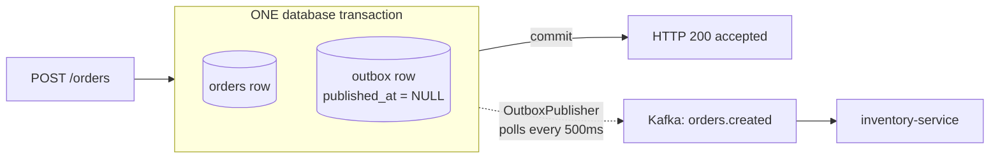
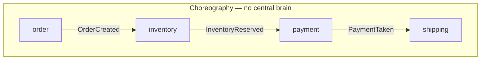
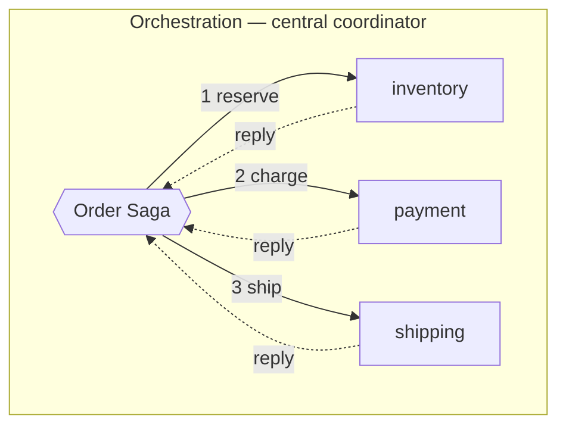

# Week 2 — Event-Driven Patterns (study sheet)

Interview one-pager #2. Same format as [week-1-concepts.md](week-1-concepts.md):
the mental model that generates correct answers, plus the trap hiding inside
it. Anchored to `order-events-system` — this week the code *is* the argument.

## 0. The dual-write problem — the crack every pattern here fills

A service that must **persist state and publish an event** has two writes to
two systems that cannot share a transaction. There is no atomic
"commit to Postgres AND to Kafka".

Both orderings are broken, just differently:

- **DB first, then publish** → crash between them: the order exists, nobody
  downstream ever hears about it. Silent, permanent inconsistency.
- **Publish first, then DB** → crash between them: consumers act on an order
  that doesn't exist. Worse — you can't unpublish.

**Trap:** "I'll just wrap both in a try/catch and roll back." You cannot roll
back a Kafka publish; consumers may already have processed it. And a
compensating "ignore that" event is itself a dual write. The problem isn't
error handling — it's that *atomicity across two systems doesn't exist*.

The escape: **make it one write.** Write the event into the same database, in
the same transaction, and relay it afterwards.

## 1. Transactional outbox — the only atomicity you actually get



`OrderController` writes the order row and the serialized `OrderCreated` event
to the `outbox` table in one `@Transactional` method. Either both land or
neither does. `OutboxPublisher` then relays pending rows and stamps
`published_at`.

The three things to say about it:

- **The relay is at-least-once, by construction.** Crash after `send()` but
  before the `published_at` update → the row is still pending → re-sent next
  tick. That is a *feature*: it converts an impossible-to-solve atomicity
  problem into a duplicate problem, and duplicates you can solve (§2).
- **It moves the guarantee, it doesn't remove the delay.** HTTP 200 now means
  "accepted and durably recorded", *not* "published". That's why the API
  response says `accepted`. Owning that wording is the point of §4 in week 1's
  accepted-vs-fulfilled distinction.
- **Poller vs. CDC.** A `@Scheduled` poll is the simple flavor; production
  often uses CDC (Debezium tailing the WAL), trading polling latency and DB
  load for operational complexity. Know both exist; we deliberately built the
  poller.

**Trap:** the outbox fixes the hop it's on — *and only that hop*. This project
is the honest example: `inventory-service` still publishes `inventory.result`
from inside its DB transaction. **Same dual write, one hop later.** Naming
your own remaining gap unprompted is exactly the signal interviewers want.

**Implementation trap (lived it):** `OutboxPublisher` never calls `save()`.
The row updates because the entity is *managed* by Hibernate inside the
transaction, so dirty checking flushes it at commit. Mutate that entity
outside its transaction and the update silently evaporates — no error.

## 2. Idempotency is a database constraint, not a data structure

Week 1 deduped with a `ConcurrentHashMap` `Set`. It was always a lie, for two
reasons that both bite in production:

- **It dies with the process.** Restart → set is empty → everything replays.
- **It's per-instance.** Two replicas = two sets = zero coordination. This is
  precisely why `k8s/03-consumers.yaml` was pinned to `replicas: 1`.

The fix is to let the database enforce it: `processed_events` with the
**primary key on `event_id`**, inserted in the *same transaction* as the
business change. Concurrent double-delivery → one commits, the other dies on
the constraint and rolls back the whole unit. The DB does the coordinating.

**The partner trap — lost updates.** Idempotency alone isn't enough; the
business write must be concurrency-safe too. `findById` → subtract → `save`
is a read-modify-write: two transactions both read `quantity=50`, both write
`48`, and one reservation vanishes. Hence:

```sql
UPDATE stock SET quantity = quantity - :qty WHERE sku = :sku AND quantity >= :qty
```

Check and decrement in **one statement**, so the row lock serializes it.
Return value 1 = reserved, 0 = insufficient. (Alternatives worth naming:
optimistic locking via `@Version`, or `SELECT ... FOR UPDATE`.)

## 3. The payload spectrum — notification vs. state transfer vs. sourcing

Three points on one axis: **how much does the event carry, and who owns the
truth?**

| Pattern | Event carries | Consumer must | Cost |
|---|---|---|---|
| **Event notification** | just an ID ("order 123 changed") | call back to the producer | coupling + producer must be up; chatty |
| **Event-carried state transfer** | the full payload | nothing — it's all there | bigger events; data duplicated and can go stale |
| **Event sourcing** | every state change, kept forever | fold events to rebuild state | the log *is* the database; replay/audit for free, real complexity cost |

This project is **event-carried state transfer**: `OrderCreatedEvent` carries
`customer_id`, `sku`, `quantity`, so `inventory-service` never calls back to
`order-service`. That's what makes the Black Friday story work — inventory can
be down two hours and catch up from the log alone.

**Trap:** "we store events in Kafka" ≠ event sourcing. Event sourcing means
the event log is the **system of record** — you rebuild state by replaying it,
not by reading a `stock` table. We have a durable log *and* an authoritative
database; that's ECST, not sourcing. Conflating them is a common tell.

## 4. Sagas — distributed transactions you can actually build

No 2PC across services. A saga is a sequence of **local** transactions, each
with a **compensating action** if a later step fails.





- **Choreography** — services react to each other's events. No coordinator,
  low coupling, easy to start. Our `order → inventory → notification` chain is
  a (trivial, two-step) choreographed saga. **Cost:** the workflow exists
  nowhere explicitly — you reconstruct it by reading N codebases, and cycles
  are easy to create by accident.
- **Orchestration** — a coordinator tells each service what to do and handles
  replies. The workflow is **one readable, testable state machine**. **Cost:**
  the orchestrator is coupling and a potential bottleneck/SPOF.

Rule of thumb: choreography for 2–3 steps, orchestration once the workflow is
long enough that "what happens after payment fails?" has no single answer.

**Trap:** compensation is not rollback. Refunding a charge is a *new*
transaction; the money moved and everyone saw it. So sagas expose intermediate
states to the outside world — you must design for "reserved but not yet paid"
being externally visible, which is exactly why the accepted-vs-fulfilled
vocabulary matters.

## 5. CQRS — split the models, not necessarily the databases

Commands (writes) and queries (reads) have different shapes, different scaling
needs, and different consistency requirements — so model them separately. The
read side is typically a **projection** built by consuming events.

**Trap:** CQRS is routinely oversold as "separate read/write databases", which
imports **eventual consistency into your own UI** — a user writes, immediately
reads, and sees stale data. That's a product decision, not a technical detail.
You can do CQRS with two models against *one* database and skip that pain
entirely. Reach for separate stores only when read scaling actually demands it.

## The meta-frame

Week 1's trade-offs were about the *transport*. Week 2's are about **state
crossing service boundaries**:

1. **Atomicity vs. reality** — you can't have distributed transactions, so you
   trade them for outbox + at-least-once + idempotency.
2. **Coupling vs. staleness** — notification (fresh, coupled) vs. ECST
   (decoupled, duplicated/stale).
3. **Explicitness vs. autonomy** — orchestration (visible workflow, central
   coupling) vs. choreography (autonomous, emergent workflow).
4. **Read scale vs. consistency** — CQRS projections vs. read-your-writes.

The unifying idea: **every one of these patterns converts an impossible
guarantee into a merely difficult one.** Outbox converts atomicity into
duplicates. Sagas convert rollback into compensation. Idempotency converts
"deliver once" into "apply once". If you can name the impossible thing and the
difficult thing it became, you're answering at the right altitude.
